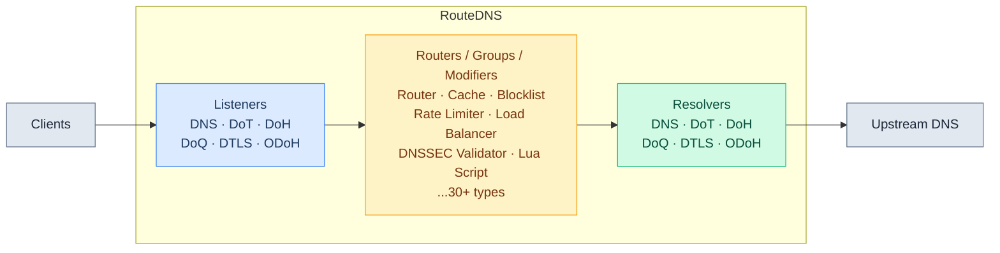
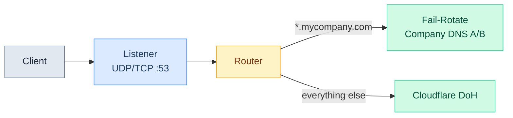
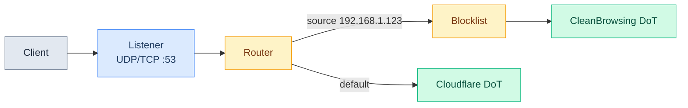
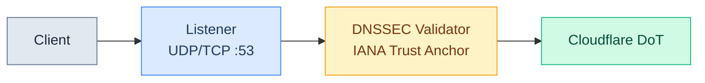

# RouteDNS

[](https://pkg.go.dev/github.com/folbricht/routedns)  

RouteDNS is a composable DNS stub resolver, proxy and router written in Go. It enables building flexible DNS processing pipelines with support for all modern DNS protocols, query routing, caching, blocklists, DNSSEC validation, Lua scripting, and 30+ other pipeline components — all configured via TOML.

## Pipeline Architecture


```mermaid
graph LR
    C[Clients] --> L
    subgraph RouteDNS
        L[Listeners<br/>DNS · DoT · DoH<br/>DoQ · DTLS · ODoH] --> P[Routers / Groups / Modifiers<br/>Router · Cache · Blocklist<br/>Rate Limiter · Load Balancer<br/>DNSSEC Validator · Lua Script<br/>...30+ types]
        P --> R[Resolvers<br/>DNS · DoT · DoH<br/>DoQ · DTLS · ODoH]
    end
    R --> U[Upstream DNS]
    classDef ext fill:#e2e8f0,stroke:#64748b,color:#1e293b
    classDef listen fill:#dbeafe,stroke:#3b82f6,color:#1e3a5f
    classDef proc fill:#fef3c7,stroke:#f59e0b,color:#78350f
    classDef resolve fill:#d1fae5,stroke:#10b981,color:#064e3b
    class C,U ext
    class L listen
    class P proc
    class R resolve
```

Listeners receive queries over any supported protocol. Routers, groups and modifiers form the processing pipeline — routing, filtering, caching, and transforming queries and responses. Resolvers forward queries upstream. Every component implements the same `Resolver` interface, so they can be composed freely.

## Features

**Protocols**
- Plain DNS over UDP and TCP, with connection reuse and pipelining
- DNS-over-TLS (DoT, [RFC 7858](https://tools.ietf.org/html/rfc7858)) — client and server
- DNS-over-HTTPS (DoH, [RFC 8484](https://tools.ietf.org/html/rfc8484)) — client and server with HTTP/2
- DNS-over-QUIC (DoQ, [RFC 9250](https://datatracker.ietf.org/doc/rfc9250/)) — client and server, with 0-RTT support
- DNS-over-DTLS ([RFC 8094](https://tools.ietf.org/html/rfc8094)) — client and server
- DNS-over-HTTPS with QUIC transport — client and server
- Oblivious DoH (ODoH, [RFC 9230](https://datatracker.ietf.org/doc/rfc9230/)) — client, proxy and target
- Custom CAs and mutual TLS (mTLS)
- SOCKS5 proxy support

**Query Processing**
- DNSSEC validation with IANA trust anchor support
- Blocklists — domain, regex, hosts-file, wildcard formats with auto-refresh from HTTP/file sources
- Response blocklists — filter by response name, IP/CIDR, GeoIP country, or ASN
- MAC address filtering via EDNS0
- Lua scripting with sandboxed execution for custom query handling logic
- Query/response modification and name translation
- Static responses using Go templates
- EDNS0 Client Subnet (ECS) manipulation ([RFC 7871](https://tools.ietf.org/html/rfc7871))
- EDNS0 query and response padding ([RFC 7830](https://tools.ietf.org/html/rfc7830), [RFC 8467](https://tools.ietf.org/html/rfc8467))

**Routing**
- Route by query name (regex), query type, query class, source IP/CIDR, or EDNS Client Subnet
- Time-of-day based routing
- Multiple routes evaluated in order — first match wins

**Resilience & Performance**
- Caching with memory or Redis backend, negative-TTL support, and prefetch
- TTL manipulation (min/max clamping)
- Multiple load-balancing algorithms: round-robin, fail-rotate, fastest, random
- Request deduplication
- Rate limiting per client subnet
- Truncate-retry (automatic TCP fallback on truncated UDP responses)
- Bootstrap addresses to avoid initial service name lookups

**Deployment**
- Linux network namespace support — listen in one netns, resolve in another
- Firewall mark (fwmark) and interface binding (SO_BINDTODEVICE) for policy routing and VRF
- Admin listener with expvar metrics (Prometheus-compatible)
- Query/response logging, syslog integration
- Platform independent — written in Go

## Installation

Requires [Go](https://golang.org/dl) 1.24+:

```text
go install github.com/folbricht/routedns/cmd/routedns@latest
```

Or build from source:

```text
git clone https://github.com/folbricht/routedns.git
cd routedns/cmd/routedns && go install
```

Pre-built binaries for common platforms (including Raspberry Pi) are available at [routedns-binaries](https://github.com/cbuijs/routedns-binaries).

### Docker

A container is available on [Docker Hub](https://hub.docker.com/r/folbricht/routedns):

```text
docker run -d --rm --network host folbricht/routedns
```

With a custom config:

```text
docker run -d --rm --network host -v /path/to/config.toml:/config.toml folbricht/routedns
```

## Quick Start

This minimal config forwards all local DNS queries encrypted via DNS-over-TLS to Cloudflare, with caching. Set your system's nameserver to `127.0.0.1` (e.g. in `/etc/resolv.conf`).

```toml
[resolvers.cloudflare-dot]
address = "1.1.1.1:853"
protocol = "dot"

[groups.cloudflare-cached]
type = "cache"
resolvers = ["cloudflare-dot"]
backend = {type = "memory"}

[listeners.local-udp]
address = "127.0.0.1:53"
protocol = "udp"
resolver = "cloudflare-cached"

[listeners.local-tcp]
address = "127.0.0.1:53"
protocol = "tcp"
resolver = "cloudflare-cached"
```

Save as `config.toml` and run:

```text
routedns config.toml
```

An example systemd service file is provided [here](cmd/routedns/routedns.service).

## Use Cases

### Corporate split DNS

Route internal queries to company DNS servers while sending everything else securely to Cloudflare via DoH. Company servers are grouped with fail-rotate for resilience.


```mermaid
graph LR
    C[Client] --> L[Listener<br/>UDP/TCP :53]
    L --> RT[Router]
    RT -->|*.mycompany.com| CO[Fail-Rotate<br/>Company DNS A/B]
    RT -->|everything else| CF[Cloudflare DoH]
    classDef ext fill:#e2e8f0,stroke:#64748b,color:#1e293b
    classDef listen fill:#dbeafe,stroke:#3b82f6,color:#1e3a5f
    classDef proc fill:#fef3c7,stroke:#f59e0b,color:#78350f
    classDef resolve fill:#d1fae5,stroke:#10b981,color:#064e3b
    class C ext
    class L listen
    class RT proc
    class CO,CF resolve
```

Configuration: [use-case-2.toml](cmd/routedns/example-config/use-case-2.toml)

### Content filtering for specific devices

Single out devices by IP address and apply a custom blocklist plus a filtered upstream resolver, while giving all other devices unfiltered access.


```mermaid
graph LR
    C[Client] --> L[Listener<br/>UDP/TCP :53]
    L --> RT[Router]
    RT -->|source 192.168.1.123| BL[Blocklist] --> CB[CleanBrowsing DoT]
    RT -->|default| CF[Cloudflare DoT]
    classDef ext fill:#e2e8f0,stroke:#64748b,color:#1e293b
    classDef listen fill:#dbeafe,stroke:#3b82f6,color:#1e3a5f
    classDef proc fill:#fef3c7,stroke:#f59e0b,color:#78350f
    classDef resolve fill:#d1fae5,stroke:#10b981,color:#064e3b
    class C ext
    class L listen
    class RT,BL proc
    class CB,CF resolve
```

Configuration: [family-browsing.toml](cmd/routedns/example-config/family-browsing.toml)

### Home network ad & malware blocking

Protect the whole network with multi-layer blocklists (query names, response names, response IPs), caching, and TTL clamping. Blocklists auto-refresh daily from remote HTTP sources.


```mermaid
graph LR
    C[Clients] --> L[Listener<br/>UDP/TCP :53]
    L --> CA[Cache]
    CA --> TTL[TTL Modifier]
    TTL --> BQ[Query Blocklist]
    BQ --> BR[Response Name<br/>Blocklist]
    BR --> BI[Response IP<br/>Blocklist]
    BI --> CF[Cloudflare DoT<br/>Fail-Rotate]
    classDef ext fill:#e2e8f0,stroke:#64748b,color:#1e293b
    classDef listen fill:#dbeafe,stroke:#3b82f6,color:#1e3a5f
    classDef proc fill:#fef3c7,stroke:#f59e0b,color:#78350f
    classDef resolve fill:#d1fae5,stroke:#10b981,color:#064e3b
    class C ext
    class L listen
    class CA,TTL,BQ,BR,BI proc
    class CF resolve
```

Configuration: [use-case-6.toml](cmd/routedns/example-config/use-case-6.toml)

### DNSSEC validation

Validate DNSSEC signatures on all responses using built-in root trust anchors. Queries with invalid signatures are rejected.


```mermaid
graph LR
    C[Client] --> L[Listener<br/>UDP/TCP :53]
    L --> DV[DNSSEC Validator<br/>IANA Trust Anchor]
    DV --> CF[Cloudflare DoT]
    classDef ext fill:#e2e8f0,stroke:#64748b,color:#1e293b
    classDef listen fill:#dbeafe,stroke:#3b82f6,color:#1e3a5f
    classDef proc fill:#fef3c7,stroke:#f59e0b,color:#78350f
    classDef resolve fill:#d1fae5,stroke:#10b981,color:#064e3b
    class C ext
    class L listen
    class DV proc
    class CF resolve
```

```toml
[resolvers.cloudflare-dot]
address = "1.1.1.1:853"
protocol = "dot"

[groups.dnssec-validated]
type = "dnssec-validator"
resolvers = ["cloudflare-dot"]

[listeners.local-udp]
address = "127.0.0.1:53"
protocol = "udp"
resolver = "dnssec-validated"

[listeners.local-tcp]
address = "127.0.0.1:53"
protocol = "tcp"
resolver = "dnssec-validated"
```

## Documentation

- [Configuration Guide](doc/configuration.md) — full reference for all component types and options
- [Example Configs](cmd/routedns/example-config/) — ready-to-use configuration files

## Links

- [RFC 7858](https://tools.ietf.org/html/rfc7858) — DNS-over-TLS
- [RFC 8484](https://tools.ietf.org/html/rfc8484) — DNS-over-HTTPS
- [RFC 9250](https://datatracker.ietf.org/doc/rfc9250/) — DNS-over-QUIC
- [RFC 9230](https://datatracker.ietf.org/doc/rfc9230/) — Oblivious DoH
- [RFC 8094](https://tools.ietf.org/html/rfc8094) — DNS-over-DTLS
- [miekg/dns](https://github.com/miekg/dns) — Go DNS library
- [quic-go](https://github.com/quic-go/quic-go) — Go QUIC implementation
