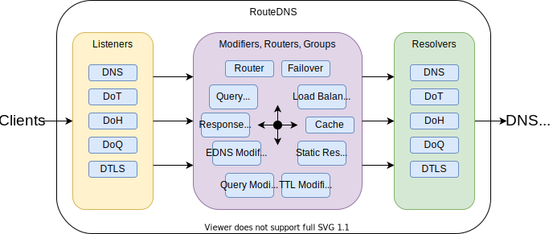

# RouteDNS - DNS stub resolver, proxy and router

[](https://godoc.org/github.com/folbricht/routedns)  

RouteDNS acts as a stub resolver and proxy that offers flexible configuration options with a focus on providing privacy as well as resiliency. It supports several DNS protocols such as plain UDP and TCP, DNS-over-TLS and DNS-over-HTTPS as input and output. In addition it's possible to build complex processing pipelines allowing routing of queries based on query name, type or source address as well as blocklists, caches and name translation. Upstream resolvers can be grouped in various ways to provide failover, load-balancing, or performance.

Features:

- Support for DNS-over-TLS (DoT, [RFC7858](https://tools.ietf.org/html/rfc7858)), client and server
- Support for DNS-over-HTTPS (DoH, [RFC8484](https://tools.ietf.org/html/rfc8484)), client and server with HTTP2
- Support for DNS-over-QUIC (DoQ, [RFC9250](https://datatracker.ietf.org/doc/rfc9250/)), client and server
- Support for DNS-over-DTLS ([RFC8094](https://tools.ietf.org/html/rfc8094)), client and server
- DNS-over-HTTPS using a QUIC transport, client and server
- Oblivious DNS client, ODoH ([RFC9230](https://datatracker.ietf.org/doc/rfc9230/))
- Oblivious DNS listener, proxy and target resolver
- Custom CAs and mutual-TLS
- Support for plain DNS, UDP and TCP for incoming and outgoing requests
- Connection reuse and pipelining queries for efficiency
- Multiple failover and load-balancing algorithms, caching, in-line query/response modification and translation (full list [here](doc/configuration.md))
- Routing of queries based on query type, class, query name, time, or client IP
- EDNS0 query and response padding ([RFC7830](https://tools.ietf.org/html/rfc7830), [RFC8467](https://tools.ietf.org/html/rfc8467))
- EDNS0 Client Subnet (ECS) manipulation ([RFC7871](https://tools.ietf.org/html/rfc7871))
- Support for bootstrap addresses to avoid the initial service name lookup
- Support for 0-RTT Quic queries if the upstream server supports it
- SOCKS5 proxy support
- Optional metrics export (expvar) to support monitoring and graphing
- Written in Go - Platform independent

## Installation

Install [Go](https://golang.org/dl) version 1.19+ then run the following to build the binary. It'll be placed in $HOME/go/bin by default:

```text
go install github.com/folbricht/routedns/cmd/routedns@latest
```

Alternative method using a clone, building from the tip of the master branch.

```text
git clone https://github.com/folbricht/routedns.git
cd routedns/cmd/routedns && go install
```

Run it:

```text
routedns config.toml
```

An example systemd service file is provided [here](cmd/routedns/routedns.service)

Example configuration files for a number of use-cases can be found [here](cmd/routedns/example-config)

### Docker container

A container is available on [Docker Hub](https://hub.docker.com/r/folbricht/routedns). It comes with a very basic configuration which is expected to be overwritten with a custom config file.

Use the default config (simple DNS -> DoT proxy):

```text
docker run -d --rm --network host folbricht/routedns
```

Override the default configuration (`/config.toml`) with a config file on the host:

```text
docker run -d --rm --network host -v /path/to/config.toml:/config.toml folbricht/routedns
```

Listen on non-standard ports:

```text
docker run -d --rm -p 5353:53/udp -p 5353:53/tcp -v /path/to/config.toml:/config.toml folbricht/routedns
```

### Pre-Compiled/Build Binaries

You can also fetch pre-compiled/build binaries for popular/common (router) platforms (Like Raspberry-Pi) here: https://github.com/cbuijs/routedns-binaries.

## Configuration

RouteDNS supports building complex DNS processing pipelines. A typically configuration would have one or more listeners to receive queries, several modifiers and routers to process the query (or responses), and then several resolvers that pass the query to upstream DNS services. See the [Configuration Guide](doc/configuration.md) for details on how to setup a pipeline.



## QUIC support

Support for the QUIC protocol is still experimental. In the context of DNS, there are two implementations, DNS-over-QUIC (DoQ, [RFC9250](https://datatracker.ietf.org/doc/rfc9250/)) as well as DNS-over-HTTPS using QUIC. Both protocols are supported by RouteDNS, client and server implementations. Quic also supports 0-RTT queries if the upstream server supports it.

## Use-cases / Examples

### Use case 1: Use DNS-over-TLS for all queries locally

In this example, the goal is to send all DNS queries on the local machine encrypted via DNS-over-TLS to Cloudflare's DNS server `1.1.1.1`. For this, the `nameserver` IP in /etc/resolv.conf is changed to `127.0.0.1`. To improve query performance a cache is added. Since there is only one upstream resolver, and everything should be sent there, no router is needed. Both listeners are using the loopback device as only the local machine should be able to use RouteDNS.


The full config file for this use-case can be found [here](cmd/routedns/example-config/use-case-1.toml)

### Use case 2: Prefer secure DNS in a corporate environment

In a corporate environment it's necessary to use the potentially slow and insecure company DNS servers. Only these servers are able to resolve some resources hosted in the corporate network. A router can be used to secure DNS whenever possible while still being able to resolve internal hosts over a VPN.


The configuration can be found [here](cmd/routedns/example-config/use-case-2.toml)

### Use case 3: Restrict access to potentially harmful content

The goal here is to single out children's devices on the network and apply a custom blocklist to their DNS resolution. Anything on the (static) blocklist will fail to resolve with an NXDOMAIN response. Names that aren't on the blocklist are then sent on to CleanBrowsing for any further filtering. All other devices on the network will have unfiltered access via Cloudflare's DNS server, and all queries are done using DNS-over-TLS. The config file can also be found [here](cmd/routedns/example-config/family-browsing.toml)


### Use case 4: Replace queries for short names with FQDN in a multi-lab environment

If adding a search list to /etc/resolv.conf is not an option, a `replace` group can be used to add the correct domain based on the name in the query. It's possible to modify or expand query strings by matching on a regex and replacing it with an alternative expression. The replace string supports expansion like `$1` to refer to a match in the regex. The `replace` can be combined with routers and resolvers as with all the other groups.

In this example, there are multiple lab VPN connections, each with their own DNS server. Queries for short names starting with `prod-` will have the domain `prod-domain.com.` appended to them and the prefix removed. Queries for `test-*` will have `test.domain.com.` appended and so on. The queries are then routed to the appropriate DNS server and responses to the client will reference the original queries with the response from the lab DNS. More than one replace rule can be defined and they are applied to the query name in order. Any other queries will pass without modification and are routed to Cloudflare.


The configuration can be found [here](cmd/routedns/example-config/use-case-4.toml)

### Use case 5: Proxying out of a restricted or un-trusted location

In this use case the goal is to use get access to unfiltered and unmonitored DNS services in a location that does not offer it normally. Direct access to well-known public DoT or DoH providers may be blocked, forcing plain DNS. It may be possible to setup an instance of RouteDNS in a less restricted location to act as proxy, offering DoH which is harder to detect and block. To prevent unauthorized access to the proxy, the config will enforce mutual-TLS with a client certificate signed by a custom CA.


The [server configuration](cmd/routedns/example-config/use-case-5-server.toml) will accept queries over DNS-over-HTTPS from authorized clients (with valid and signed certificate), and forward all queries to Cloudflare using DNS-over-TLS.

The [client configuration](cmd/routedns/example-config/use-case-5-client.toml) acts as local DNS resolver, handling all queries from the local OS. Every query is then forwarded to the secure proxy using DoH. The client needs to have a signed certificate as the server is configured to require it.

### Use case 6: Protecting the home-network from ads and malware domains using blocklists

In this use-case, a whole internal network can be protected from unwanted content such as ads and malware. This can be achieved by running RouteDNS in the local network, filtering out known-bad domains or networks. There are 3 different types of filters applied:

- Queries are filtered through a list of bad domains
- Responses are filtered if they contain names on a blocklist
- Responses that contain IPs in known-bad networks are blocked, regardless of what query name was used

These blocklists are loaded and refreshed daily by RouteDNS daily over HTTP. Refresh happens transparently and does not impact query performance. In addition, this configuration caches responses and adjusts TTL values to reduce the amount of queries caused by TTL values that are set too low.


The configuration can be found [here](cmd/routedns/example-config/use-case-6.toml)

## Links

- DNS-over-TLS RFC - [https://tools.ietf.org/html/rfc7858](https://tools.ietf.org/html/rfc7858)
- DNS-over-HTTPS RFC - [https://tools.ietf.org/html/rfc8484](https://tools.ietf.org/html/rfc8484)
- DNS-over-QUIC RFC - [https://www.rfc-editor.org/rfc/rfc9250](https://www.rfc-editor.org/rfc/rfc9250)
- EDNS0 padding [RFC7830](https://tools.ietf.org/html/rfc7830) and [RFC8467](https://tools.ietf.org/html/rfc8467)
- Go QUIC implementation - [https://github.com/lucas-clemente/quic-go](https://github.com/lucas-clemente/quic-go)
- Go DNS library - [https://github.com/miekg/dns](https://github.com/miekg/dns)
- DTLS library - [https://github.com/pion/dtls](https://github.com/pion/dtls)
